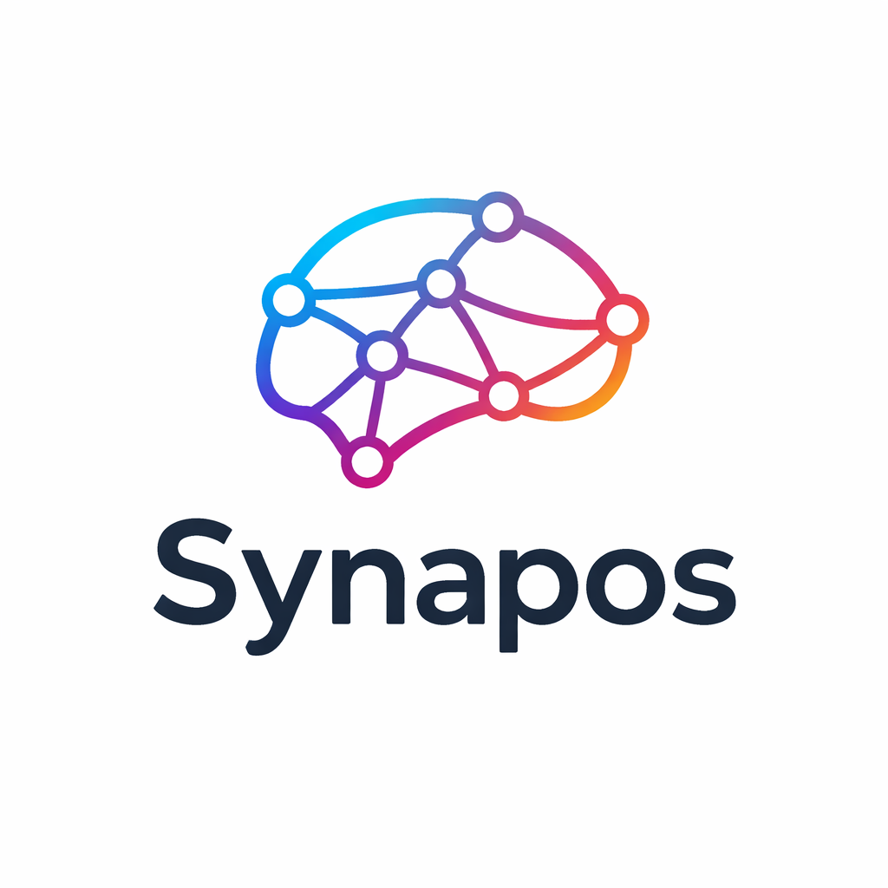

<p align="center">
  
</p>

# Synapos

> Contexto persistente por feature para trabalhar com IA em projetos reais.

A IA esquece tudo entre conversas. O Synapos resolve isso com uma pasta por feature que acumula **o que é, por que existe, decisões tomadas e o que não fazer** — lida por qualquer role de IA antes de começar.

```bash
npx synapos
```

---

## Como funciona

```
/init "corrigir bug do login"
  → detecta stack
  → abre ou cria docs/.squads/sessions/bug-login/
  → executa pipeline: investigar → executar → verificar
```

**Três steps. Um gate real.** No final, o Synapos roda `lint/test/typecheck/build` conforme `docs/_memory/stack.md`. Se falha, tenta corrigir uma vez. Se falha de novo, escala com a session preservada.

---

## O que persiste

```
docs/.squads/sessions/{feature}/
├── context.md     ← o que é, por que, decisões, o que não fazer
├── memories.md    ← aprendizados acumulados
└── state.json     ← runs do pipeline nesta session
```

Entre conversas, entre roles, entre dias.

---

## Roles disponíveis

| Role | Domínio |
|---|---|
| `engineer` | Genérico — feature, bug, refactor (default para qualquer stack) |
| `frontend` | UI, componentes, estado |
| `backend` | APIs, schema, auth |
| `fullstack` | Features integradas front + back |
| `mobile` | React Native, Flutter, iOS, Android |
| `devops` | CI/CD, containers, IaC, observabilidade |
| `produto` | PRDs, specs, discovery |
| `ia-dados` | ML, pipelines de dados, LLM apps |

O role é inferido da sua mensagem. Se não for claro, o Synapos pergunta uma vez.

---

## Comandos

```
/init              → ponto de entrada principal
/session           → navegar sessions
/session {slug}    → abrir uma session específica
/session consolidate → compactar memories.md quando crescer demais

/setup:discover    → escanear o código e gerar docs/_memory/stack.md
/setup:build-tech  → gerar docs/tech/
/setup:build-business → gerar docs/business/

/set-model         → mudar modelo em preferences.md
/bump              → versionar o pacote
```

---

## Qualidade integrada — GATE-VERIFY

Um gate. Real. Roda shell.

No último step do pipeline, executa os comandos definidos em `docs/_memory/stack.md`:

```markdown
## Comandos
- Lint: npm run lint
- Test: npm test
- Typecheck: npx tsc --noEmit
- Build: npm run build
```

Falhou? Tenta corrigir uma vez. Falhou de novo? Para e avisa. Sem teatro, sem loop infinito.

---

## Decisões fora do escopo

O agent **nunca decide sozinho** o que está fora do escopo definido em `context.md`. Em vez disso, sinaliza:

```
[?] decisão: adicionar cache em memória ou usar Redis?
   A) em memória — simples, perde em restart
   B) Redis — persiste, adiciona dependência
   Recomendação: B, o projeto já tem Redis para sessions
```

O usuário decide. O pipeline segue.

---

## Estrutura instalada

```
.synapos/
├── core/
│   ├── orchestrator.md       ← fluxo de entrada
│   ├── pipeline-runner.md    ← executa os steps
│   ├── gate-system.md        ← GATE-VERIFY
│   └── commands/             ← /session, /setup, /set-model, /bump
├── skills/                   ← integrações opcionais (brave-search, github, etc.)
├── squad-templates/          ← 8 roles, cada um com template.yaml + persona.md
└── squads/                   ← roles ativos da sua feature atual

docs/
├── _memory/                  ← perfil + stack + preferências (edição manual)
├── .squads/sessions/         ← sessions por feature (contexto persistente)
├── tech/                     ← opcional, gerado por /setup:build-tech
└── business/                 ← opcional, gerado por /setup:build-business
```

---

## Compatibilidade

Funciona com qualquer IDE que suporte slash-commands em LLMs:

- Claude Code
- Cursor
- Trae
- OpenCode
- Antigravity
- GitHub Copilot (via `synapos:init`)

Qualquer modelo: Claude, GPT, Gemini, DeepSeek, Qwen, modelos locais.

---

## O que o Synapos NÃO é

- ❌ Não é multi-agent real — roles são personas sequenciais no mesmo modelo.
- ❌ Não garante execução determinística — é tão bom quanto o modelo escolhido.
- ❌ Não substitui decisões humanas — estrutura o contexto para a IA trabalhar melhor.
- ❌ Não executa por você — chama as ferramentas que o IDE já expõe.

---

## Instalação

```bash
npx synapos
```

Seleciona IDE, copia `.synapos/` + templates, cria os slash-commands.

```bash
npx synapos frontend backend   # só templates específicos
npx synapos --help
```

---

## Filosofia

Um pipeline. Três steps. Um gate real. Nada de cerimônia.

Versões anteriores tinham 9 steps, 3 checkpoints síncronos, 5 "gates" textuais e 8 templates duplicados. Isso era fricção disfarçada de disciplina.

O que permanece: contexto persistente por feature. É o único valor real.

---

## Contribua

Projeto open source em evolução.

👉 [Abra uma issue](https://github.com/devjefferson/synapos/issues)
👉 Dê uma estrela se achar útil
