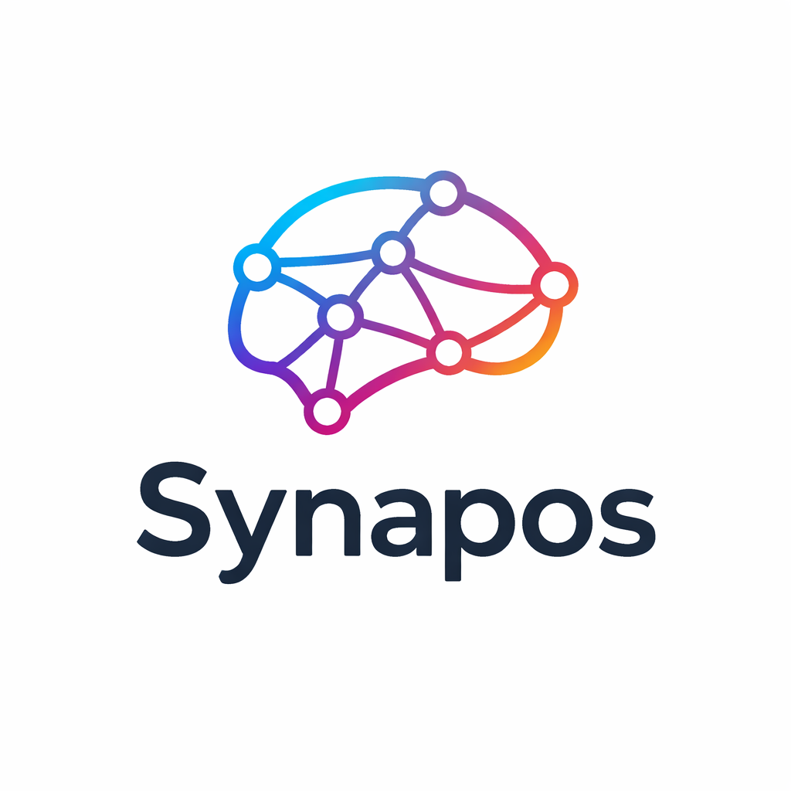

<p align="center">
  
</p>

# Synapos

> Workflow system para trabalhar com IA em projetos reais.

Synapos organiza **como você usa LLMs no desenvolvimento** — não é um agente mágico, é uma estrutura que faz a IA trabalhar melhor no seu projeto específico.

```bash
npx synapos
```

---

## O que é

Synapos é um **exército de um homem só**: uma única IA trabalhando através de roles especializadas — produto, arquitetura, desenvolvimento, review — cada uma com o contexto, a memória e as skills certas.

Ele resolve dois problemas concretos: **a IA esquece tudo entre conversas** e **a IA inventa o que o projeto já tem**.

Cada feature do seu projeto ganha uma **session** — uma pasta com contexto persistente que qualquer role de IA lê antes de começar a trabalhar. O resultado é uma IA que sabe o que foi decidido, por que, e o que não fazer.

```
docs/.squads/sessions/{feature}/
├── context.md       ← o que é, por que existe, decisões tomadas, o que não fazer
├── memories.md      ← aprendizados acumulados
├── architecture.md  ← desenho técnico
└── plan.md          ← plano de execução
```

Isso persiste entre conversas, entre roles, entre dias.

---

## O que não é

- ❌ Não é multi-agent real — os roles são simulados sequencialmente pelo mesmo modelo
- ❌ Não garante execução determinística — é tão bom quanto o modelo que você usa
- ❌ Não substitui código ou decisões de arquitetura — estrutura o ambiente para a IA trabalhar melhor

---

## Como funciona

```
/init         → detecta sessões interrompidas e retoma ou abre o menu
/setup:squad  → cria um novo role: domínio → modo → agents → session
              → pipeline executa steps
              → contexto salvo na session
```

Ao retomar uma sessão interrompida, o `/init` exibe progresso (steps concluídos/total), tempo desde a suspensão e oferece: retomar de onde parou, reiniciar do zero ou inspecionar os arquivos da session antes de decidir.

---

## Profundidade adaptativa

A tarefa define o processo — o Synapos faz a triagem sozinho:

| Track | Exemplo | Fluxo |
|------|---------|-------|
| ⚡ quick | "alterar o texto de um botão" | contexto → role → skills → executar → revisar (sem squad, sem session) |
| 🔵 standard | "nova tela de listagem" | investigação → padrões do projeto → arquitetura → implementação → review |
| 🧠 complex | "quero um módulo de pedidos" | produto (brainstorm → requisitos → spec → handoff) → arquitetura → plano → dev → review |

## Memória que aprende o projeto uma vez

```
docs/_memory/
├── project-memory.md     ← regras, decisões, padrões e aprendizados tipados
├── adr-index.md          ← 1 linha por ADR — ADR ativa é regra em todo track
├── skills-index.md       ← skills do projeto e instaladas, selecionadas por step
└── roles/frontend.md     ← padrões reais: containers, componentes, estados, formulários
```

Cada step recebe só o que a decisão precisa — e declara o que carregou e por quê (Context Brief). Memória obsoleta é detectada no ponto de uso, nunca sobrescrita em silêncio.

No **Claude Code**, hooks instalados em `.claude/settings.json` impõem o que é mecânico: o mapa de memória (com frescor verificado) é injetado no início da sessão, `.synapos/` é protegido contra escrita e `.env*` nunca entra num commit. `SYNAPOS_HOOKS=off` desliga.

---

## O diferencial real: sessions

A maioria das ferramentas de IA trata cada conversa como um começo do zero.

Com Synapos, cada feature acumula contexto ao longo do tempo:

- **Decisões registradas** → a IA não repropõe o que já foi descartado
- **Armadilhas documentadas** → erros não se repetem
- **Contexto compartilhado** → qualquer role que entrar na feature lê o mesmo contexto

```bash
/session              # lista todas as features ativas
/session auth-module  # abre o contexto de uma feature específica
/session consolidate  # compacta memórias quando o arquivo crescer
/setup:squad          # cria um novo role (squad) para uma feature
```

---

## Qualidade integrada

- **Observe antes de criar** → reuso de padrão/componente existente antes de qualquer coisa nova; "novo" exige justificativa
- **ADR é contrato** → conflito com ADR ativa bloqueia a decisão até aprovação (`[ADR-CONFLICT]`)
- **Sem invenção** → afirmação sobre o projeto precisa de evidência; métrica desconhecida vira `[A DEFINIR]`
- **Gates** → integridade, estrutura, qualidade, ADR e handoff (`.synapos/core/gate-system.md`)

Decisões fora do escopo são sinalizadas com `[DECISÃO PENDENTE]` (ou `[?]`) — a role para e aguarda sua aprovação.

---

## Skills (integrações)

```bash
npx synapos add skill brave-search
npx synapos add skill playwright
npx synapos add skill github
```

Skills injetam ferramentas ou critérios no contexto da role. Skills do próprio projeto (`skills/*.md`, `.claude/skills/`) também são descobertas — e só as relevantes para o step são carregadas.

---

## Estrutura gerada

```
.synapos/               → core do framework (não edite)
  squads/               → configuração dos roles ativos
  squad-templates/      → templates por domínio
  skills/               → integrações instaladas
docs/
  _memory/              → perfil do projeto e preferências
  .squads/sessions/     → contexto persistente por feature
  _memory/roles/        → padrões descobertos por domínio
  tech/                 → documentação técnica (opcional)
  business/             → documentação de negócio (opcional)
```

---

## Arquitetura

`docs/architecture/` — review da v4, memória, skills, fluxo de produto, guia de roles e cenários de validação. `npm test` valida a integridade do framework.

## Compatibilidade

Funciona em qualquer IDE com suporte a agentes:

- Claude Code
- Cursor
- Trae
- OpenCode

Compatível com qualquer modelo (Claude, GPT, Gemini, modelos locais).

---

## Instalação

```bash
npx synapos
```
---

## Contribua

Projeto open source em evolução.

👉 [Abra uma issue](https://github.com/devjefferson/synapos/issues)
👉 Dê uma estrela se achar útil
